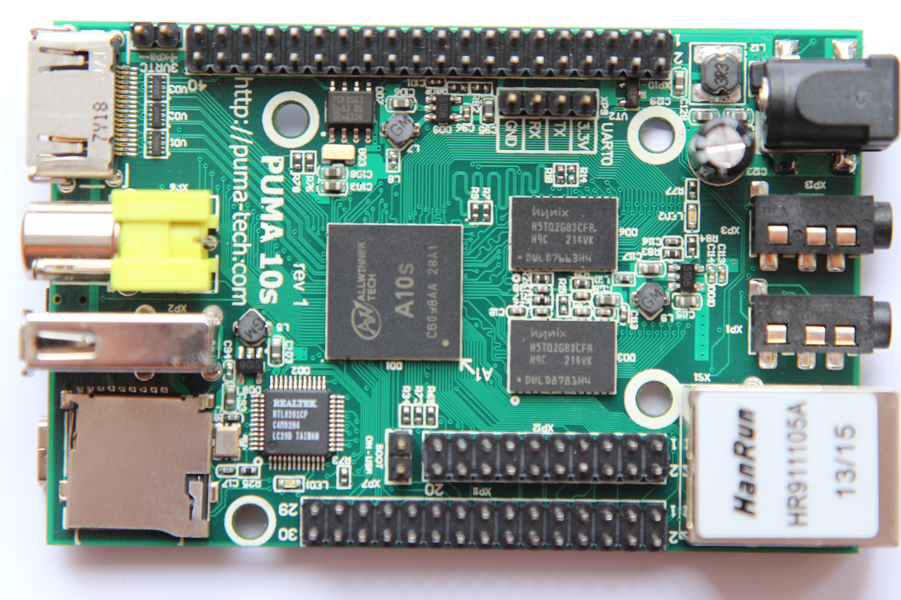
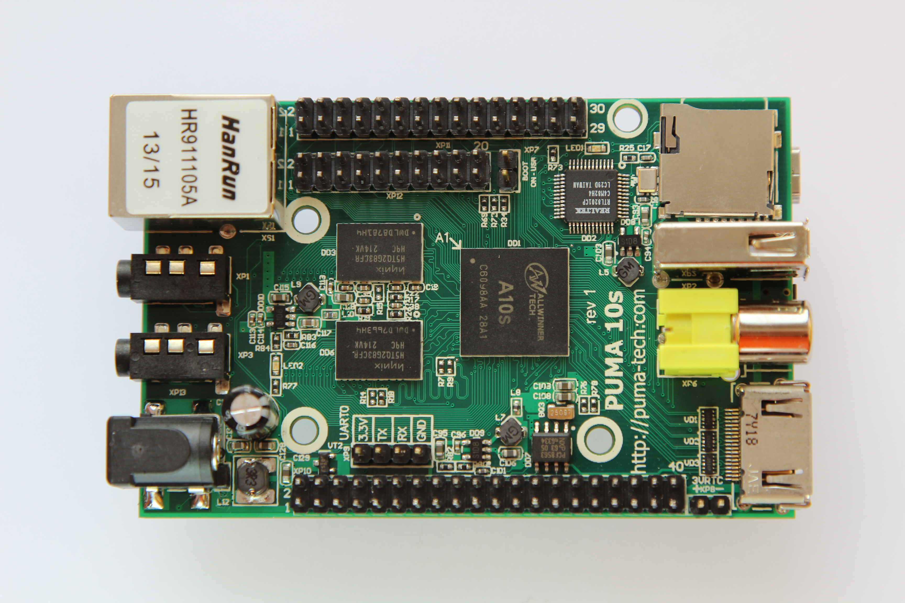

# PUMA-10S Single-Board Computer

This is a project for a single-board computer (SBC) developed in Tomsk, Russia, back in 2014. The board is comparable in its features to a Raspberry Pi of that time. A key feature of this board is its compact, credit-card-sized dimensions (85x55 mm), making it suitable for applications where space is a premium. The device is capable of running Linux-based operating systems.

## Technical Specifications

*   **Processor:** Allwinner A10s (ARM Cortex-A8), 1 GHz
*   **GPU:** Mali 400
*   **RAM:** 512 MB DDR3, 432 MHz
*   **Permanent Storage:** Micro SD card slot
*   **Video Interfaces:** HDMI, Composite
*   **Audio Interfaces:** Headphones, Line-in (3.5mm jack)
*   **USB:** 1x USB Host (Type-A) + 1x USB OTG (Mini-USB)
*   **Ethernet:** 100Base-TX
*   **Camera:** CAMIF (CSI) interface
*   **Serial:** 4x UART, 3x I2C, 1x SPI (+1 for external SD card)
*   **Real-Time Clock (RTC):** PCF8563 (with battery connector)
*   **ADC:** 2 low-frequency inputs
*   **PWM:** 1 output
*   **Other I/O:** MPEG TS input, Microphone input, IR sensor input, Touch screen input
*   **Power:** 6-18V DC, or 5V via USB OTG
*   **Dimensions:** 85x55 mm
*   **PCB:** 4 layers

## Project Files

*   **`PUMA-10S_V2.1.PrjPcb`**: Altium Designer Project file.
*   **`*.SchDoc`**: Schematic files.
*   **`*.PcbDoc`**: PCB layout files.
*   **`Project Outputs for PUMA-10S_V2.1/`**: Directory with Gerbers and other manufacturing files.
*   **`SCH_PUMA-10S_V2.1.pdf`**: Schematic in PDF format.
*   **`Assembly Drawings.pdf`**: Assembly drawings in PDF format.

## Board Images

---

# Одноплатный микрокомпьютер PUMA-10S

Проект одноплатного микрокомпьютера, разработанный в 2014 году в г. Томск, Россия. По своим характеристикам плата похожа на Raspberry Pi. Отличительной особенностью является размер с кредитную карту (85х55 мм), что позволяет использовать ее в компактных решениях. Устройство позволяет запускать операционные системы на базе ядра Linux.

## Технические характеристики

*   **Процессор:** Allwinner A10s (ARM Cortex-A8), 1 ГГц
*   **Графика:** Mali 400
*   **ОЗУ:** 512 МБ DDR3, 432 МГц
*   **Постоянная память:** карта Micro SD
*   **Графические интерфейсы:** HDMI, композитный
*   **Звуковые интерфейсы:** наушники, линейный вход (jack 3.5)
*   **USB:** 1x USB Host (USB A) + 1x USB OTG (mini USB)
*   **Ethernet:** 100Base-TX
*   **Камера:** интерфейс CAMIF (CSI)
*   **Последовательные порты:** 4x UART, 3x I2C, 1x SPI (+1 для внешней SD карты)
*   **Часы реального времени (RTC):** PCF8563 (с разъемом для батареи)
*   **АЦП:** 2 низкочастотных входа
*   **ШИМ (PWM):** 1 выход
*   **Прочее:** вход MPEG TS, вход для микрофона, вход для ИК-датчика, вход для сенсорного экрана
*   **Питание:** 6-18В или 5В через USB OTG
*   **Размеры:** 85x55 мм
*   **Печатная плата:** 4 слоя

## Файлы проекта

*   **`PUMA-10S_V2.1.PrjPcb`**: Файл проекта Altium Designer.
*   **`*.SchDoc`**: Файлы схем.
*   **`*.PcbDoc`**: Файлы печатной платы.
*   **`Project Outputs for PUMA-10S_V2.1/`**: Директория с Gerber-файлами и другими производственными файлами.
*   **`SCH_PUMA-10S_V2.1.pdf`**: Схема в формате PDF.
*   **`Assembly Drawings.pdf`**: Сборочные чертежи в формате PDF.

## Изображения платы

